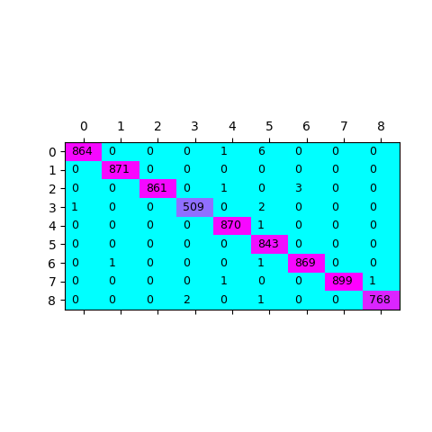

# RoBERTa-japanese

Japanese BERT Pretrained Model

RoBERTaとは、[Liu, Yinhanらが提案](https://arxiv.org/abs/1907.11692)する、BERTの改良版です。モデル構造そのものはオリジナルのBERTと同じで、学習手法に工夫があります。


#RoBERTa (改良BERT)  日本語モデル

***<font color='red'>New</font>***

- [事前学習済みbaseモデルを公開しました](report/models.md)


## RoBERTa (改良BERT) の日本語版です

### 学習済みモデルについて

[report/models.md](report/models.md)

### TODO

✓baseモデルの公開（2020/11/28）<br>□largeモデルの公開<br>


# 使い方


GitHubからコードをクローンします

```sh
$ git clone https://github.com/tanreinama/RoBERTa-japanese
$ cd RoBERTa-japanese
```

モデルファイルをダウンロードして展開します

```sh
$ wget https://www.nama.ne.jp/models/RoBERTa-ja_base.tar.bz2
$ tar xvfj RoBERTa-ja_base.tar.bz2
```

分かち書きに使う[Japanese-BPEEncoder](https://github.com/tanreinama/Japanese-BPEEncoder)をコピーします

```sh
$ git clone https://github.com/tanreinama/Japanese-BPEEncoder.git
$ cp Japanese-BPEEncoder/* ./
```


##  クラス分類サンプル


クラス分類問題は、BERTモデルに入力される「[CLS]」トークンに対するtransformerの出力を、全結合層で分類します。

サンプルプログラムは、

```
dir/<classA>/textA.txt
dir/<classA>/textB.txt
dir/<classB>/textC.txt
・・・
```

のように、「クラス名/ファイル」という形でテキストファイルが保存されている前提で、テキストファイルをクラス毎に分類するモデルを学習します。

ここでは、[livedoor ニュースコーパス](http://www.rondhuit.com/download.html#ldcc)を使用する例をサンプルとして提示します。

まず、コーパスをダウンロードして展開すると、「text」以下に記事の入っているディレクトリが作成されます。

```sh
$ wget https://www.rondhuit.com/download/ldcc-20140209.tar.gz
$ tar xvfz ldcc-20140209.tar.gz
$ ls text/
```

### クラス分類モデルの学習

ここではファイル1つを1データとして扱うので、「--input」にコーパスのディレクトリを、「--model」にモデル名を入れて、「train-classifier.py」を実行します。

学習したモデルは、「checkpoint」以下の「--run_name」で指定したディレクトリ内に保存されます。

```sh
$ PYTHONPATH=pretraining python train-classifier.py --input text --model RoBERTa-ja_base --run_name run_classifier1
```

以下のようにサブディレクトリ名とクラスIDとの対応が表示された後、学習が進みます。

```sh
text/dokujo-tsushin mapped for id_0, read 871 contexts.
text/it-life-hack mapped for id_1, read 871 contexts.
text/kaden-channel mapped for id_2, read 865 contexts.
text/livedoor-homme mapped for id_3, read 512 contexts.
text/movie-enter mapped for id_4, read 871 contexts.
text/peachy mapped for id_5, read 843 contexts.
text/smax mapped for id_6, read 871 contexts.
text/sports-watch mapped for id_7, read 901 contexts.
text/topic-news mapped for id_8, read 771 contexts.
```

ここでは1ファイルが1データとして扱っていますが、「--train_by_line」オプションを指定することで、テキストファイル内のテキスト1行ずつを1データとして扱うことも出来ます。

### クラス分類の推論

推論は、「predict-classifier.py」を実行します。入力テキストの形式は学習時と同じです。

```sh
$ PYTHONPATH=pretraining python predict-classifier.py --input text --model checkpoint/run_classifier1
```

出力先は、分類結果のcsvファイルで、デフォルトは「predict.csv」です。

「--output_file」オプションで変更出来ます。

```sh
$ head -n5 predict.csv
id,y_true,y_pred
dokujo-tsushin/dokujo-tsushin-6140446.txt,0,0
dokujo-tsushin/dokujo-tsushin-6502782.txt,0,0
dokujo-tsushin/dokujo-tsushin-5292054.txt,0,0
dokujo-tsushin/dokujo-tsushin-6340031.txt,0,0
```

分類結果を、タイル表示で可視化した結果も、「出力ファイル名_map.png」という名前で保存されます。




## 文章のベクトル化


RoBERTaのモデルはtransformerベースなので、入力されたBPEに対して、それぞれの対応するベクトルを出力します。

### transform

入力文章に対して、分かち書きしたBPEに対応するベクトルを全て出力するには、「bert-transform.py」を起動します。

すると、「--context」で指定した文章を分かち書きして、対応するBPEのベクトルの列を返します。

```sh
$ PYTHONPATH=pretraining python bert-transform.py --context "俺の名前は坂本俊之。何処にでもいるサラリーマンだ。" --model checkpoint/run_classifier1
input#0:
[[-1.5291613e+00 -3.2096574e-01 -1.0254933e+00 ...  1.6606779e+00
  -1.5821679e-01 -5.2546853e-01]
 [-1.3548117e+00 -1.2981821e+00 -1.3456922e+00 ...  1.8837800e+00
  -8.6869076e-02 -6.7544264e-01]
・・・（略）
```

### 文章全体のベクトル化

BPEではなく、文章に対応するベクトルは、「[CLS]」トークンに対する出力ベクトルを利用します。

文章のベクトル化を行うには、「bert-transform.py」を「--output_cls」オプションを指定して起動します。

```sh
$ PYTHONPATH=pretraining python bert-transform.py --context "俺の名前は坂本俊之。何処にでもいるサラリーマンだ。" --model checkpoint/run_classifier1 --output_cls
input#0:
[-1.37854981e+00 -1.44807804e+00 -1.28895664e+00 -2.42752731e-01
 -1.52671874e+00 -6.45978153e-02  3.82195622e-01 -1.02298462e+00
 -1.28983960e-01  9.94315445e-01  1.64299178e+00 -9.62380469e-01
 -1.08913469e+00  1.45287836e+00 -1.74040571e-01  1.11346889e+00
・・・（略）
```

すると、文章を固定長のベクトルに出来ます。


##  モデルのファインチューニング


[コーパス2020](https://github.com/tanreinama/gpt2-japanese/blob/master/report/corpus.md)でプレトレーニングしたモデルは公開しています。ここでの手順、独自のデータでモデルをさらにファインチューニングする方法です。

### エンコード

[Japanese-BPEEncoder](https://github.com/tanreinama/Japanese-BPEEncoder)を使用して、学習させたい独自のデータをエンコードします。

```sh
$ git clone https://github.com/tanreinama/Japanese-BPEEncoder.git
$ cd Japanese-BPEEncoder
$ python encode_bpe.py --src_dir <content file path> --dst_file finetune
$ mv finetune.npz ../
$ cd ..
```

### 学習

「--restore_from」に元のプレトレーニング済みモデルを、「--model」にモデルの種類を、「--dataset 」にエンコードしたファイルを指定して、「pretraining/train.py」を起動します。

```sh
$ PYTHONPATH=pretraining python pretraining/train.py --restore_from RoBERTa-ja_base --model base --dataset funetune.npz --run_name RoBERTa-finetune_run1
```

学習したモデルは、「checkpoint」以下の「--run_name」で指定したディレクトリ内に保存されます。


# REFERENCE

[RoBERTa: A Robustly Optimized BERT Pretraining Approach](https://arxiv.org/abs/1907.11692)


